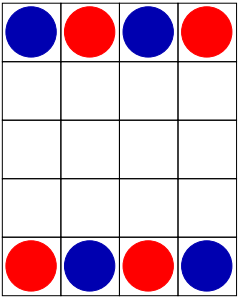

# TicTacToe board game

This game can be played by two people. Each player has four circles (blue and red). The board is 5x4.



The players move their circles one after another and the one has three of their circles horizontal,vertical or diagonal wins.

To run the application:
```
mvn package
java -jar ./target/homework-project-kadarkutir-1.0.jar
```


